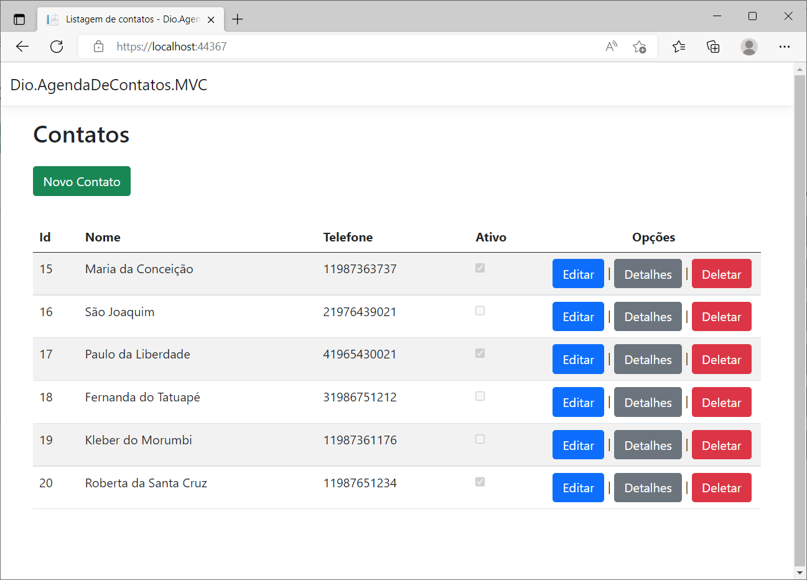
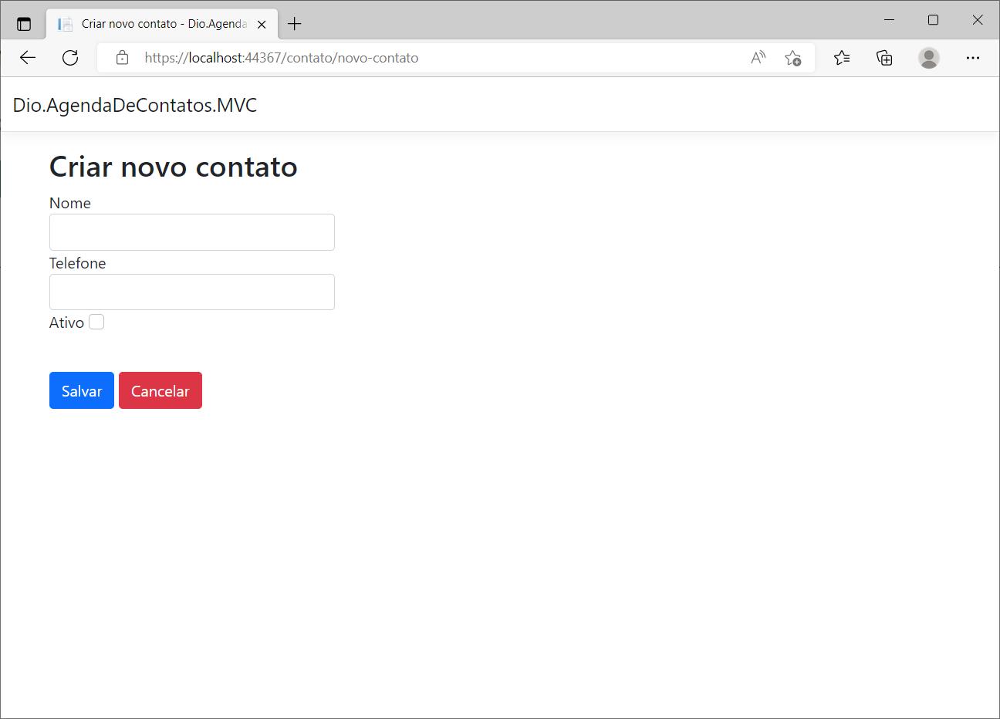
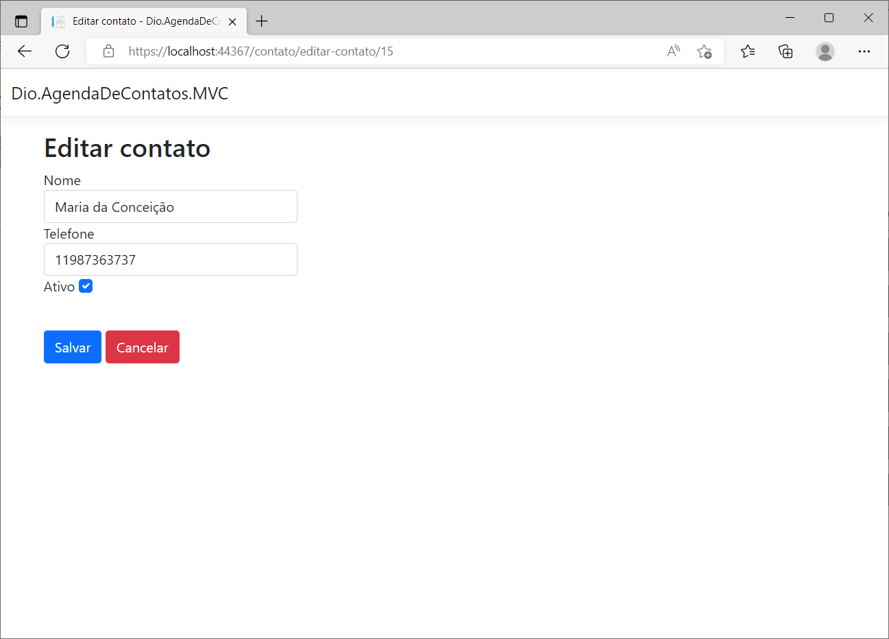
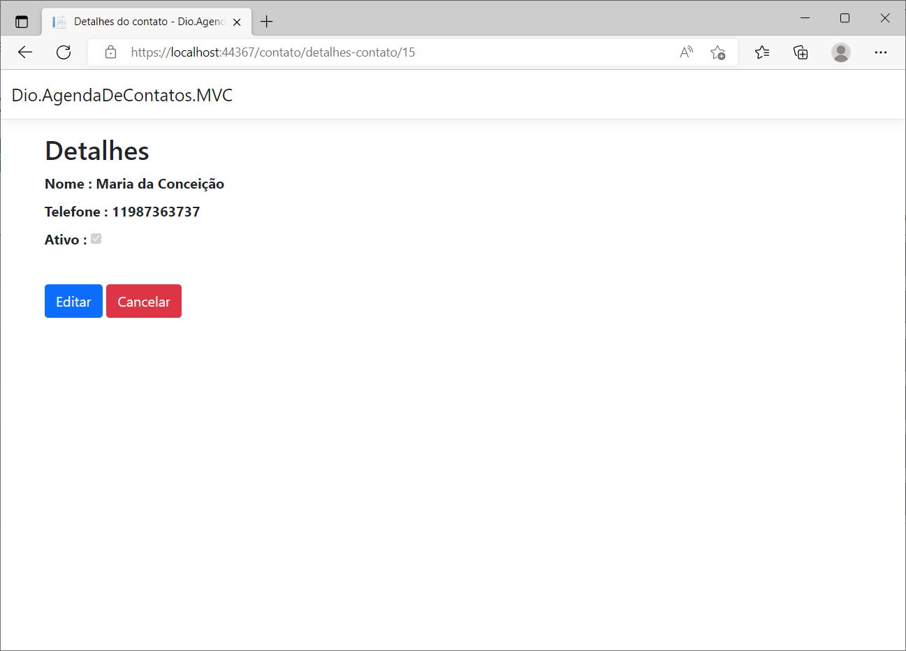
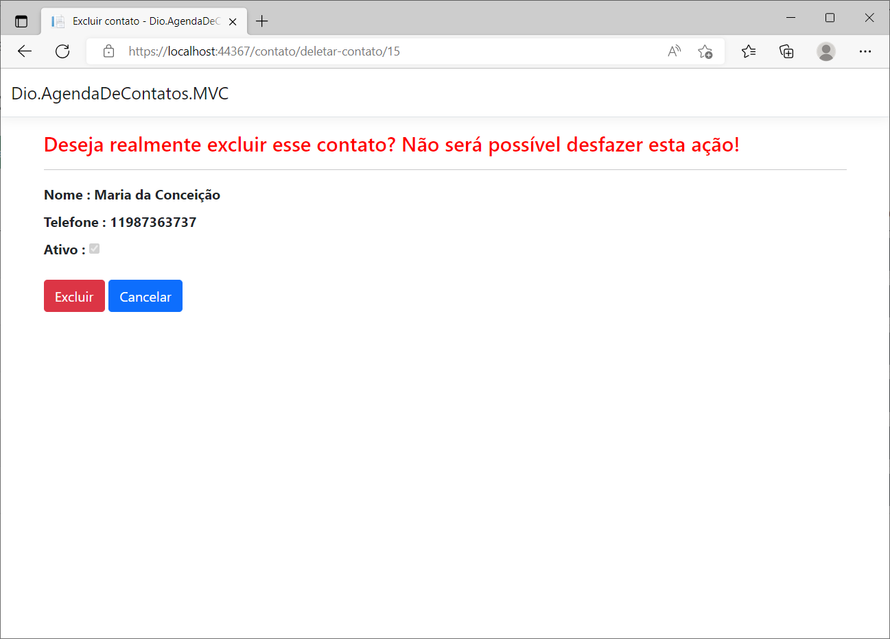
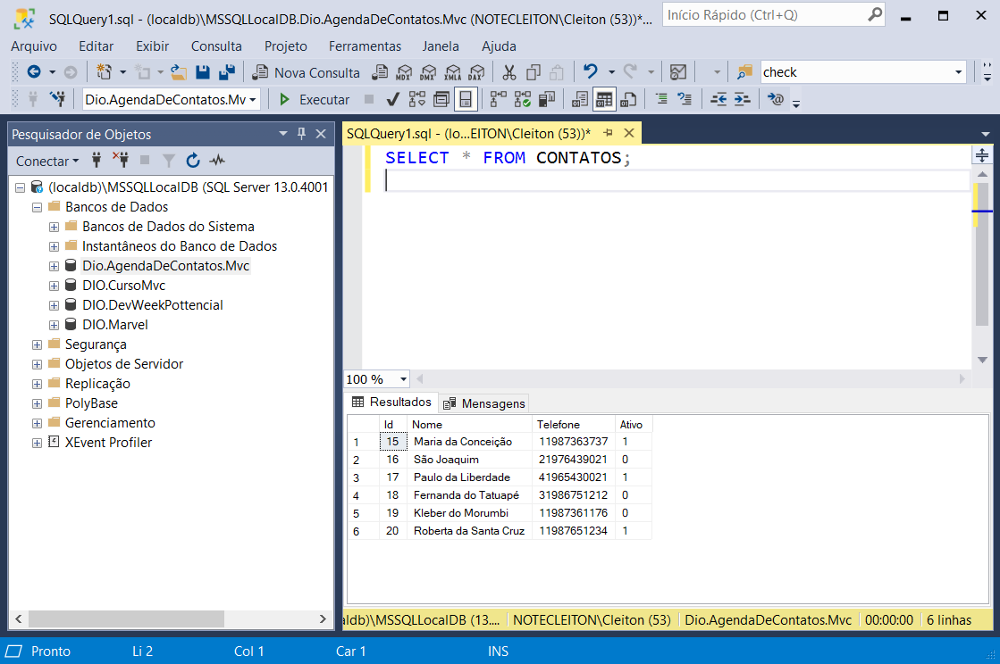

# DIO.BootcampPottencial.AgendaDeContatos.MVC 📞

Aplicação desenvolvida utilizando a estrutura MVC (Model-View-Controller) em .NET 6, EntityFramework, Bootstrap e SqlServer, onde é possível realizar as operações básicas do CRUD em registros de contatos telefônicos.

### Página de Listagem de Registros: ###

### Página de Cadastro: ###

### Página de Edição: ###

### Página de Detalhes: ###

### Página de Deleção: ###

### Banco De Dados MySQL ###

